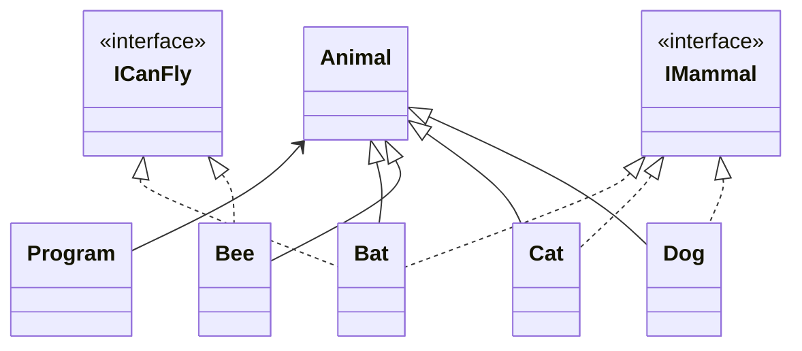

### Flowchart

```mermaid
 classDiagram
Animal <-- Program

Animal <|-- Bat
Animal <|-- Bee
Animal <|-- Cat
Animal <|-- Dog

IMammal <|.. Bat
IMammal <|.. Cat
IMammal <|.. Dog

ICanFly <|.. Bat
ICanFly <|.. Bee

class IMammal{
<<interface>>
}
class ICanFly{
<<interface>>
}


```
